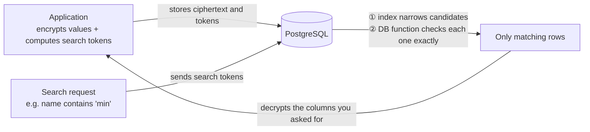

<div align="center">

# SealQL

**Search PostgreSQL fields while they stay encrypted**

[](README.md) [](README_ko.md)

[](LICENSE)
[](#performance)
[](examples/drizzle/v0.45/README.md)
[](package.json)

</div>

<br>

## Why SealQL

Some services need to encrypt specific fields. Regulations or contracts may require it for personal or financial data, or a team may simply want a stronger security posture. Which fields to encrypt is a choice each business makes.

The trouble starts when an encrypted field has to be **searched**. The database only sees ciphertext, so it cannot answer questions like "customers whose name contains 'min'" or "how many customers match this condition". Existing approaches usually stop at one of two places: they can only find **exact matches**, or they support richer search but become **too slow for a real service**.

SealQL was built to close that gap. Values are stored encrypted, while **substring search and counting still run inside the database, and run fast**.

<br>

## What SealQL does

- Encrypts **only the columns you choose** in a PostgreSQL table, with AES-256-GCM.
- Searches encrypted columns by **exact match, contains, starts with, ends with, and LIKE patterns**.
- **Counts matches exactly inside the database**, without decrypting a single value.
- Decrypts **only the rows you actually return** when you list results.
- Keeps your ORM and SQL habits. JOINs, ordering, pagination, and aggregates work the way you already write them.

<br>

## Packages

SealQL has two parts.

| Import path | Role |
|---|---|
| `sealql` | Core: field encryption and decryption, search-token computation, and other ORM-independent pieces |
| `sealql/drizzle/v0.45` | **Drizzle ORM 0.45** adapter: table definitions, writes, search, counts, and migrations in the Drizzle style |

Today SealQL ships an adapter for Drizzle ORM 0.45. Other ORMs and versions are added as new adapters on the same core.

<br>

## How it works



When a value is written, SealQL stores two things: the **ciphertext**, and **search tokens** computed with your key that do not carry the original value.

When you search, the database first narrows candidates with an index, and a function that SealQL installs in the database checks each candidate exactly. Results and counts therefore **match a plaintext search row for row**. The key that decrypts data stays in your application and is never sent to the database.

<br>

## What you can do

| Task | How |
|---|---|
| Search encrypted columns | Exact match, contains, starts with, ends with, LIKE, and AND/OR combinations |
| Count | `sealed.count` returns an exact number |
| Sum, average, and other aggregates | For rows found by an encrypted condition, compute `sum`, `avg`, or `count` over regular columns in a normal Drizzle query |
| JOINs, subqueries, ordering | Put the condition from `sealed.where` into the Drizzle query you already write |
| Writes | `sealed.insert`, `update`, and `upsert` store ciphertext and search tokens in one transaction |

<br>

## Performance

Measured on a **100,000-row** customer table against the same data stored as plaintext. Every result matched the plaintext search exactly.

**Search (up to 20 rows returned, total time including decryption)**

| Query | Rows | Plaintext | SealQL |
|---|---:|---:|---:|
| Name exact match | 2 | 0.3 ms | 3.6 ms |
| Name contains "김민" | 20 | 0.5 ms | 8.1 ms |
| Name starts with "al" | 20 | 0.6 ms | 30.2 ms |
| Name ends with "z6" | 20 | 0.7 ms | 8.9 ms |
| LIKE `al%z6` | 8 | 0.6 ms | 6.1 ms |
| Name contains AND address contains | 20 | 0.6 ms | 8.0 ms |
| Customer ⨝ ticket JOIN list | 20 | 0.6 ms | 6.2 ms |

**Counts and aggregates (28,023 matching rows)**

| Query | Plaintext | SealQL |
|---|---:|---:|
| Customers whose name contains "김민" | 16 ms | 115 ms |
| Sum of their points (`sum`) | 18 ms | 142 ms |
| Average of their points (`avg`) | 18 ms | 143 ms |
| Customer ⨝ ticket JOIN count | 33 ms | 196 ms |

```mermaid
xychart-beta
    title "28,023 matching rows (ms, lower is faster)"
    x-axis ["count", "sum", "avg", "JOIN count"]
    y-axis "ms" 0 --> 200
    bar [115, 142, 143, 196]
    bar [16, 18, 18, 33]
```



<sub>Bars: the tall bar is SealQL, the short inner bar is plaintext. Setup: local PostgreSQL 18, 100,000 synthetic rows, median of 7 runs after 2 warm-ups. The plaintext table used B-tree and trigram indexes. Searches with few results finish in a few milliseconds; aggregates over tens of thousands of rows take longer than plaintext because the database checks each row.</sub>

<br>

## Install

```sh
pnpm add sealql drizzle-orm@0.45
# or
npm install sealql drizzle-orm@0.45
```

Requires Node.js 22.12 or later, and also runs on Cloudflare Workers (`nodejs_compat`). For writes, use a PostgreSQL driver that supports transactions, such as `pg` or `postgres`.

<br>

## Quick start

```ts
import { pgTable, uuid } from 'drizzle-orm/pg-core';
import { createSealer } from 'sealql';
import { createSealed } from 'sealql/drizzle/v0.45';

// Load the 32-byte encryption key from your secret store.
const sealed = createSealed({ sealer: createSealer({ key: rootKey }) });

export const customer = pgTable('customer', {
  id: uuid('id').primaryKey(),
  name: sealed.text('name', { search: { exact: true, substring: true } }),
});
export const customerSeal = sealed.register(customer, { row: 'id' });

// Write: ciphertext and search tokens are stored together.
await sealed.insert(db, customerSeal, { id: crypto.randomUUID(), name: 'Minsu Kim' });

// Search: only matching rows are decrypted and returned.
const page = await sealed.findMany(db, customerSeal, {
  match: m => m.name.contains('min'), limit: 20,
});

// Count
const total = await sealed.count(db, customerSeal, { match: m => m.name.contains('min') });
```

After your migrations, also run the SQL returned by `sealed.extraMigrationSql(customerSeal)`. It installs the database functions that check search conditions.

<br>

## Learn more

SealQL does not have a separate documentation site. Instead, the package ships **a guide written to be read together with AI tools**.

> **Point your AI assistant at [`llms.txt`](llms.txt).** It is also inside the installed package (`node_modules/sealql/llms.txt`). It leads to the right guide and example code, so a request like "use SealQL to encrypt and search the customer name column" is enough for the assistant to work out the details.

- **[Usage guide and examples](examples/README.md)**: key handling, per-column search settings, JOINs, and migration order
- **[Drizzle ORM 0.45 guide](examples/drizzle/v0.45/README.md)**: API reference with runnable example code
- **[Changelog](CHANGELOG.md)**

<br>

## License

[Apache License 2.0](LICENSE)
