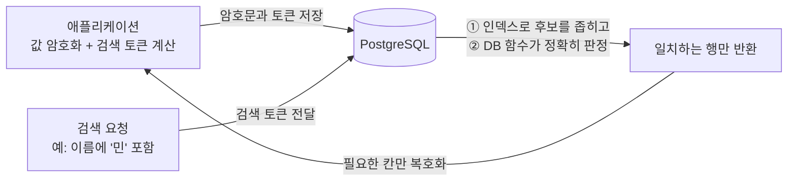

<div align="center">

# SealQL

**PostgreSQL 필드를 암호화한 채로 검색하는 라이브러리**

[](README.md) [](README_ko.md)

[](LICENSE)
[](#성능)
[](examples/drizzle/v0.45/README.md)
[](package.json)

</div>

<br>

## 왜 SealQL인가요

서비스에 따라서는 특정 필드를 반드시 암호화해야 할 때가 있습니다. 개인정보나 거래 정보처럼 규정이나 계약으로 보호 수준이 정해진 경우도 있고, 스스로 보안을 한층 강화하고 싶은 경우도 있습니다. 어떤 필드를 암호화할지는 각 비즈니스가 선택할 문제입니다.

문제는 암호화한 필드를 **검색**해야 할 때 생깁니다. 데이터베이스는 암호문만 보기 때문에 "이름에 '민'이 들어간 고객"이나 "이 조건에 맞는 고객 수" 같은 질문에 답하기 어렵습니다. 그래서 지금 쓰이는 방법들은 대개 둘 중 하나에 머뭅니다. **값이 정확히 같은지만** 찾을 수 있거나, 더 많은 검색을 지원하는 대신 **실제 서비스에 쓰기 어려울 만큼 느립니다.**

SealQL은 이 문제를 풀기 위해 만들었습니다. 값은 암호화해서 저장하면서도 **부분 검색과 개수 세기를 데이터베이스 안에서 빠르게** 처리합니다.

<br>

## SealQL이 하는 일

- PostgreSQL 테이블에서 **원하는 칸만 골라** AES-256-GCM으로 암호화합니다.
- 암호화된 칸을 **정확히 일치, 포함, 시작·끝, LIKE 패턴**으로 검색할 수 있습니다.
- 검색 결과의 **개수는 데이터베이스가 정확히 세고**, 이 과정에서 복호화는 한 번도 일어나지 않습니다.
- 목록을 조회할 때는 **실제로 돌려주는 행만** 애플리케이션에서 복호화합니다.
- 기존 ORM과 SQL 사용 방식을 그대로 유지합니다. JOIN, 정렬, 페이지 나누기, 일반 칼럼 집계는 평소처럼 쓰면 됩니다.

<br>

## 구성

SealQL은 두 부분으로 나뉩니다.

| 패키지 경로 | 역할 |
|---|---|
| `sealql` | 코어. 필드 암호화·복호화, 검색용 토큰 계산 등 ORM과 무관한 기능 |
| `sealql/drizzle/v0.45` | **Drizzle ORM 0.45** 어댑터. 테이블 정의, 쓰기, 검색, 개수, 마이그레이션을 Drizzle 방식으로 제공 |

지금은 Drizzle ORM 0.45 어댑터를 제공합니다. 다른 ORM이나 버전은 같은 코어 위에 어댑터를 추가하는 방식으로 늘어납니다.

<br>

## 어떻게 동작하나요



값을 저장할 때 SealQL은 두 가지를 함께 기록합니다. 하나는 **암호문**이고, 다른 하나는 키로 계산해 원래 값을 그대로 담지 않는 **검색용 토큰**입니다.

검색할 때는 데이터베이스가 먼저 인덱스로 후보를 빠르게 좁히고, SealQL이 설치한 데이터베이스 함수가 후보마다 조건을 정확히 판정합니다. 그래서 결과와 개수가 평문으로 검색했을 때와 **한 건도 다르지 않습니다.** 암호를 푸는 키는 애플리케이션에만 있고, 데이터베이스로는 보내지 않습니다.

<br>

## 할 수 있는 것

| 작업 | 방법 |
|---|---|
| 암호화된 칸 검색 | 정확히 일치, 포함, 시작, 끝, LIKE, AND/OR 조합 |
| 개수 세기 | `sealed.count`가 정확한 숫자를 돌려줍니다 |
| 합계·평균 등 집계 | 암호화된 조건으로 찾은 행에 대해, 일반 칼럼의 `sum`, `avg`, `count`를 Drizzle 쿼리로 그대로 계산 |
| JOIN·서브쿼리·정렬 | `sealed.where`로 만든 조건을 평소 쓰던 Drizzle 쿼리에 넣으면 됩니다 |
| 쓰기 | `sealed.insert`, `update`, `upsert`가 암호문과 검색 토큰을 한 트랜잭션으로 저장 |

<br>

## 성능

고객 **10만 행** 테이블에서, 같은 데이터를 평문으로 저장한 테이블과 비교했습니다. 모든 결과는 평문 검색과 한 건도 다르지 않았습니다.

**검색 (결과 최대 20행, 복호화 포함 전체 시간)**

| 질의 | 결과 행 | 평문 | SealQL |
|---|---:|---:|---:|
| 이름 정확히 일치 | 2 | 0.3 ms | 3.6 ms |
| 이름에 "김민" 포함 | 20 | 0.5 ms | 8.1 ms |
| 이름이 "al"로 시작 | 20 | 0.6 ms | 30.2 ms |
| 이름이 "z6"로 끝남 | 20 | 0.7 ms | 8.9 ms |
| LIKE `al%z6` | 8 | 0.6 ms | 6.1 ms |
| 이름 포함 AND 주소 포함 | 20 | 0.6 ms | 8.0 ms |
| 고객 ⨝ 티켓 JOIN 목록 | 20 | 0.6 ms | 6.2 ms |

**개수와 집계 (조건에 맞는 행 28,023개)**

| 질의 | 평문 | SealQL |
|---|---:|---:|
| 이름에 "김민" 포함한 고객 수 | 16 ms | 115 ms |
| 그 고객들의 포인트 합계 (`sum`) | 18 ms | 142 ms |
| 그 고객들의 포인트 평균 (`avg`) | 18 ms | 143 ms |
| 고객 ⨝ 티켓 JOIN 개수 | 33 ms | 196 ms |

```mermaid
xychart-beta
    title "조건에 맞는 행 28,023개일 때 (ms, 낮을수록 빠름)"
    x-axis ["count", "sum", "avg", "JOIN count"]
    y-axis "ms" 0 --> 200
    bar [115, 142, 143, 196]
    bar [16, 18, 18, 33]
```



<sub>막대: 긴 막대가 SealQL, 안쪽의 짧은 막대가 평문. 측정 환경: 로컬 PostgreSQL 18, 합성 데이터 10만 행, 예열 2회 뒤 7회 측정의 중앙값. 평문 테이블은 B-tree와 trigram 인덱스를 사용했습니다. 결과가 적은 검색은 수 ms 안에 끝나고, 결과가 수만 행인 집계는 행마다 데이터베이스에서 판정하므로 평문보다 시간이 더 걸립니다.</sub>

<br>

## 설치

```sh
pnpm add sealql drizzle-orm@0.45
# 또는
npm install sealql drizzle-orm@0.45
```

Node.js 22.12 이상이 필요하고, Cloudflare Workers(`nodejs_compat`)에서도 동작합니다. 쓰기에는 트랜잭션을 지원하는 PostgreSQL 드라이버(`pg`, `postgres` 등)를 사용하세요.

<br>

## 빠르게 시작하기

```ts
import { pgTable, uuid } from 'drizzle-orm/pg-core';
import { createSealer } from 'sealql';
import { createSealed } from 'sealql/drizzle/v0.45';

// 32바이트 암호화 키는 비밀 저장소에서 불러옵니다.
const sealed = createSealed({ sealer: createSealer({ key: rootKey }) });

export const customer = pgTable('customer', {
  id: uuid('id').primaryKey(),
  name: sealed.text('name', { search: { exact: true, substring: true } }),
});
export const customerSeal = sealed.register(customer, { row: 'id' });

// 저장: 암호문과 검색 토큰이 함께 기록됩니다.
await sealed.insert(db, customerSeal, { id: crypto.randomUUID(), name: '김민수' });

// 검색: 일치하는 행만 복호화해서 돌려줍니다.
const page = await sealed.findMany(db, customerSeal, {
  match: m => m.name.contains('민'), limit: 20,
});

// 개수
const total = await sealed.count(db, customerSeal, { match: m => m.name.contains('민') });
```

마이그레이션 뒤에는 `sealed.extraMigrationSql(customerSeal)`이 돌려주는 SQL을 함께 실행해 주세요. 데이터베이스 판정 함수가 설치됩니다.

<br>

## 더 알아보기

SealQL은 별도의 문서 사이트 대신, **AI 도구와 함께 쓰도록 정리한 안내서**를 패키지에 담아 제공합니다.

> **AI에게 [`llms.txt`](llms.txt)를 읽게 하세요.** 설치된 패키지(`node_modules/sealql/llms.txt`)에도 들어 있습니다. 이 파일에서 시작해 필요한 가이드와 예시 코드로 안내되므로, "SealQL로 고객 테이블의 이름을 암호화하고 검색하는 코드를 만들어 줘"처럼 요청하면 구체적인 사용법을 스스로 파악합니다.

- **[사용 가이드와 예시](examples/README.md)** — 키 관리, 칸별 검색 설정, JOIN, 마이그레이션 순서
- **[Drizzle ORM 0.45 가이드](examples/drizzle/v0.45/README.md)** — API 설명과 실행 가능한 예시 코드
- **[변경 기록](CHANGELOG.md)**

<br>

## 라이선스

[Apache License 2.0](LICENSE)
